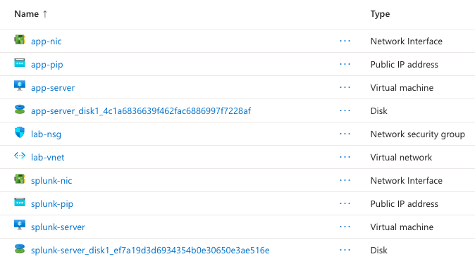
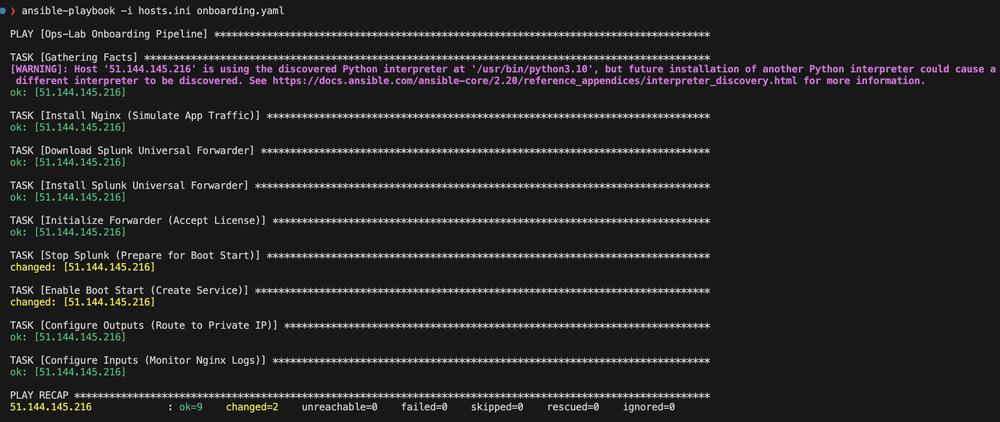
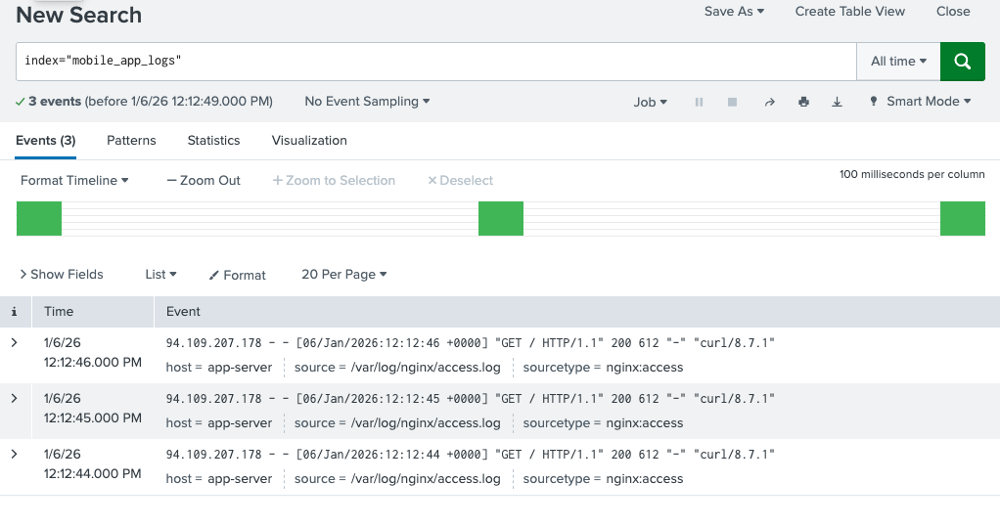

#  Ops-Lab: Automated Splunk Onboarding on Azure

## 📋 Project Overview
This project demonstrates a complete **DevSecOps pipeline** to automate the infrastructure provisioning and monitoring onboarding for a web application.

The goal is **Zero-Touch Deployment**: From an empty Azure subscription to visualized logs in Splunk, ensuring security best practices (Private IPs, Network Segmentation, Secret Management).

## 🏗 Architecture
* **Cloud Provider:** Azure (Sandbox)
* **Infrastructure as Code:** Terraform
* **Configuration Management:** Ansible
* **Observability:** Splunk Enterprise (Indexer) & Universal Forwarder (Agent)

**Data Flow:**
`Nginx App Server` --(Private Network)--> `Splunk Indexer (Port 9997)`

## 📂 Project Structure
```text
ops-lab/
├── infra/               # Terraform Code
│   ├── main.tf          # Resources (VMs, NICs, NSGs)
│   ├── variables.tf     # Variable definitions
│   └── terraform.tfvars # Secrets (Not committed)
├── config/              # Ansible Code
│   ├── onboarding.yaml  # Main Playbook
│   ├── hosts.ini        # Inventory
│   └── secrets.yml      # Password Vault (Not committed)
└── README.md            # Documentation

##  How to Run (Step-by-Step)

### Prerequisites

* Azure CLI installed and logged in (`az login`).
* Terraform installed.
* Ansible installed.
* An SSH Key pair generated (`~/.ssh/id_rsa`).

### Phase 1: Infrastructure (Terraform)

Since secrets are excluded from Git, you must create the variable file locally.

1. Create `infra/terraform.tfvars`:
```hcl
resource_group_name = "YOUR_AZURE_RG_NAME"
ssh_key_path        = "/Users/your_user/.ssh/id_rsa.pub"

```


2. Provision the resources:
```bash
cd infra
terraform init
terraform apply -auto-approve

```


*Note: Note down the Public IPs outputted at the end.*

### Phase 2: Splunk Server Setup (One-off)

*Because this is a Lab environment, the Splunk Server is set up manually once.*

1. SSH into the Splunk Server: `ssh azureuser@<SPLUNK_PUBLIC_IP>`
2. Download and install Splunk Enterprise (v9.1.2).
3. Enable listening on port 9997.
4. Create the index `mobile_app_logs` via the Web UI.

### Phase 3: Automation (Ansible)

This step automates the client (App Server) configuration.

1. Update `config/hosts.ini` with the **App Server Public IP**.
2. Create `config/secrets.yml` locally:
```yaml
splunk_pass: "LabSecurePass123!"

```


3. Update `config/onboarding.yaml` variables with your specific IPs (Splunk Public & Private IPs).
4. Run the playbook:
```bash
cd config
export ANSIBLE_HOST_KEY_CHECKING=False
ansible-playbook -i hosts.ini onboarding.yaml

```


---

## 🔧 Challenges & Troubleshooting (My Learning Journey)

This project simulated real-world infrastructure issues. Here is how I diagnosed and resolved them:

### 1. The "Silent Drop" (Networking)

* **Issue:** SSH timeouts to the VMs despite having an "AllowAll" Security Group Rule.
* **Diagnosis:** I inspected the Network Interface (NIC) in the Azure Portal and realized no Security Group was attached to it.
* **Fix:** Terraform created the NSG but failed to associate it. I updated `main.tf` to include the `azurerm_network_interface_security_group_association` resource, linking the NSG to the NICs explicitly.

### 2. The "Ghost Version" (Deprecation)

* **Issue:** Ansible failed with HTTP 404 errors during the Splunk Forwarder download task.
* **Root Cause:** Hardcoded URLs in the playbook pointed to version 9.1.1, which Splunk had removed from their CDN.
* **Fix:** Updated the playbook to dynamically point to the latest stable release (9.1.2) to ensure artifact availability.

### 3. The "Service Conflict" (Boot Start)

* **Issue:** Ansible failed at the "Enable Boot Start" task with error: `splunk is currently running`.
* **Fix:** Added a task to explicitly stop the Splunk service before attempting to modify the boot-start configuration, ensuring a clean systemd registration.

### 4. The "Missing Mailbox" (Index Mismatch)

* **Issue:** The Forwarder was successfully connected (confirmed via `index=_internal`), but Nginx application logs were missing from search results.
* **Diagnosis:** I audited the `inputs.conf` generated by Ansible and compared it with the Splunk Server configuration.
* **Root Cause:** A typo in the configuration logic. The agent was sending data to `mobile_app_logs`, but the server expected `mobile_logs`.
* **Fix:** I aligned the configuration by creating the correct index `mobile_app_logs` on the Splunk Indexer.

---

## 📈 Evidence of Success

**1. Infrastructure Provisioned (Azure)**


**2. Ansible Pipeline Success**


**3. Real-time Log Streaming**


---

## 🧹 Cleanup

To avoid Azure costs, destroy the infrastructure:

```bash
cd infra
terraform destroy -auto-approve

```


